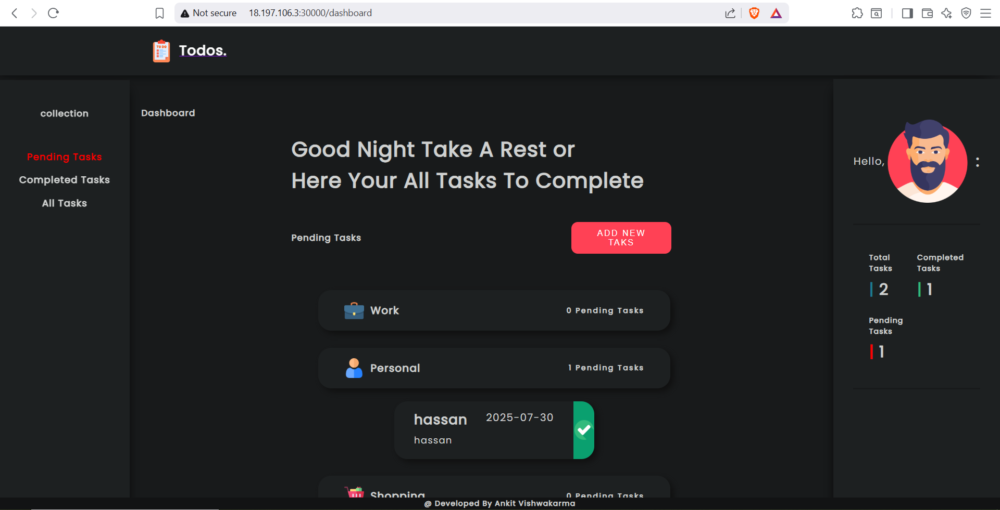

## 📌 **To-Do List CI/CD Project**

> Deploying a Node.js To-Do List app with Docker, Ansible, Kubernetes & ArgoCD

---

## 📚 Table of Contents

* [Project Overview](#-project-overview)
* [Architecture](#-architecture)
* [Milestones & Implementation](#-milestones--implementation)

  * [Part 1 – Containerization & CI](#part-1--containerization--ci)
  * [Part 2 – VM & Configuration Management](#part-2--vm--configuration-management)
  * [Part 3 – Deployment & Auto-Update](#part-3--deployment--auto-update)
  * [Part 4 (Bonus) – Kubernetes & GitOps](#part-4-bonus--kubernetes--gitops)
* [CI/CD Pipeline Details](#-cicd-pipeline-details)
* [Security & Secrets](#-security--secrets)
* [Challenges & Solutions](#-challenges--solutions)
* [How to Run Locally](#️-how-to-run-locally)
* [Author](#-author)

---

## 🧩 **Project Overview**

This project demonstrates building a modern DevOps pipeline for a simple Node.js To-Do List application:

* Dockerized app connected to MongoDB
* Automated CI pipeline with GitHub Actions
* Infrastructure setup with Ansible
* Deployment with Docker Compose + Watchtower (for auto updates)
* Bonus: Migration to Kubernetes with ArgoCD for GitOps

The goal is to apply real-world DevOps practices step by step.

---

## 🏗 **Architecture**

```
┌──────────────┐         ┌──────────────┐
│  GitHub Repo │  CI/CD │ Docker Hub   │
└──────┬───────┘         └──────┬───────┘
       │ build & push image     │
       ▼                        ▼
┌─────────────────────────────┐
│ VM (EC2) running Ubuntu     │
│ ┌─────────────┐   ┌───────┐ │
│ │ App (Node)  │   │ Mongo │ │
│ └─────────────┘   └───────┘ │
│   ▲   ▲                ▲    │
│   │   │ docker compose │    │
│   │   └────────────┐   │    │
│ watchtower        Ansible   │
└─────────────────────────────┘
       ▲
       │
    ArgoCD (Bonus: GitOps)
```

---

## ✅ **Milestones & Implementation**

### Part 1 – Containerization & CI

* Forked & cloned: [Original Repo](https://github.com/Ankit6098/Todo-List-nodejs)
* Wrote `Dockerfile`:

  * Used official Node base image
  * Exposed port `4000`
  * Used multi-stage build to keep image small
* Added `.env` with MongoDB URL (Atlas)
* Created `.github/workflows/docker.yml`:

  * On push to `main` branch:

    * Build Docker image
    * Tag with `latest` and/or build number
    * Push to Docker Hub (private repo)

**Why:** CI ensures each code change creates a deployable image.

---

### Part 2 – VM & Configuration Management

* Provisioned **EC2 t3.xlarge** (Ubuntu 22.04) on AWS
* Configured Ansible dynamic inventory with AWS plugin
* Wrote `configure-vm.yml` playbook:

  * Create `ansible-user` with SSH key
  * Install Docker & Docker Compose
  * Add user to docker group

**Why:** Automates reproducible environment; avoids manual SSH steps.

---

### Part 3 – Deployment & Auto-Update

* Wrote `docker-compose.yml`:

  * `todolist-app` + `mongodb` services
  * Health checks on both
  * `watchtower` to poll for new image tags & auto pull
* Wrote `deploy-app.yml` playbook:

  * Copy compose file to VM
  * Login to Docker registry
  * Run `docker compose up`

**Why:** Docker Compose keeps services consistent; Watchtower enables auto-update.

---

### Part 4 (Bonus) – Kubernetes & GitOps

* Installed **k3s** (lightweight K8s) on VM
* Converted docker-compose to YAML manifests manually:

  * Deployments, Services, PersistentVolumeClaim
* Installed **ArgoCD** in `argocd` namespace
* Connected GitHub repo to ArgoCD:

  * Auto-sync deployment manifests

**Why:** ArgoCD automates CD; changes in Git trigger K8s updates.

---

## 🔧 **CI/CD Pipeline Details**

* Trigger: push to `main`
* Builds Docker image
* Tags with `latest` & build number
* Pushes to Docker Hub
* Watchtower (in prod) polls & updates container

---

## 🔑 **Security & Secrets**

* Used GitHub Secrets for Docker Hub username/password
* `.env` (with Mongo URL) excluded via `.gitignore`
* In production: recommend using Vault or AWS Secrets Manager

---

## 🧠 **Challenges & Solutions**

| Challenge                   | Solution                                               |
| --------------------------- | ------------------------------------------------------ |
| Mongo data lost on redeploy | Added PersistentVolume (PVC) on K8s; volume in Compose |
| Limited resources on VM     | Used k3s; small footprint                              |
| CI image tagging            | Added build number instead of only `latest`            |
| Auto update images          | Watchtower for Docker; ArgoCD for K8s                  |

---

## 📷 **Screenshots**
#### **Dockerhub private Repository** 


#### **CI Pipeline**


#### **Docker Compose**


#### **Application**




**Note** In last screenshot the port in the url is different from last screenshots because this screen from kubernetes deployments not docker compose.

## ▶️ **How to Run Locally**

```bash
git clone https://github.com/Bahnasy2001/todo-list-devops.git
cd todo-list-devops
docker compose up --build
```

App runs on `http://localhost:4000`

---

## 👤 **Author**

* **Name:** Hassan El Bahnasy
* **Email:** [hassanbahnasy872@gmail.com](hassanbahnasy872@gmail.com)
* **LinkedIn/GitHub:** \[link]
